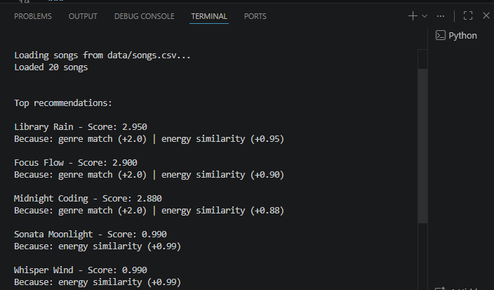

# 🎵 Music Recommender Simulation

## Project Summary

In this project you will build and explain a small music recommender system.

Your goal is to:

- Represent songs and a user "taste profile" as data
- Design a scoring rule that turns that data into recommendations
- Evaluate what your system gets right and wrong
- Reflect on how this mirrors real world AI recommenders

Replace this paragraph with your own summary of what your version does.

-  My recommendation system utilizes Content-bases filtering to suggest music. By analyzing attributes like genre, energy, and tempo_bpm from the song dataset, the system calculates a compatibility score for each track relative to the user's profile. My version prioritizes mood consistency, weighting emotional attributes more heavily than technical attributes like BPM to ensure the 'vibe' remains cohesive.

## How The System Works

Each song is represented by attributes such as genre, mood, energy, tempo_bpm, valence, danceability, and acousticness. The user profile stores a favorite genre, a favorite mood, and a target energy level. The recommender computes a score for each song by giving +2.0 points for a genre match, +1.0 point for a mood match, and an energy similarity score based on how close the song's energy is to the target. Songs are then ranked by total score and the highest-scoring tracks are returned as the top recommendations.

---

## Getting Started

### Setup

1. Create a virtual environment (optional but recommended):

   ```bash
   python -m venv .venv
   source .venv/bin/activate      # Mac or Linux
   .venv\Scripts\activate         # Windows

2. Install dependencies

```bash
pip install -r requirements.txt
```

3. Run the app:

```bash
python -m src.main
```

### Running Tests

Run the starter tests with:

```bash
pytest
```

You can add more tests in `tests/test_recommender.py`.

---

## Experiments You Tried

Use this section to document the experiments you ran. For example:

- What happened when you changed the weight on genre from 2.0 to 0.5
- What happened when you added tempo or valence to the score
- How did your system behave for different types of users

---

## Limitations and Risks

Summarize some limitations of your recommender.

Examples:

- It only works on a tiny catalog
- It does not understand lyrics or language
- It might over favor one genre or mood

### Potential Biases in the Scoring System

My system weights **Genre (2.0) > Mood (1.0) = Energy (1.0)**, giving genre 50% of the total possible score. This means the model can over-prioritize genre labels over the actual mood or energy-driven vibe of a song, so a track that feels right may be ranked lower if it is tagged in a different genre. This creates several biases:

1. **Genre Dominance Bias**: A song with the *perfect mood and energy* but the *wrong genre* will be heavily penalized and ranked below mediocre matches. For example, a "Jazz" song with "chill" mood and 0.28 energy scores only 1.98/4.0, while a "Lofi" song with "chill" mood and 0.35 energy (slightly worse energy match) scores 3.95/4.0. Users exploring new genres or crossover styles will miss great recommendations.

2. **Categorical Cliff**: Genre and mood are binary (match or don't match). If a user specifies "lofi" but the CSV has a row labeled "lo-fi" (or vice versa) or if a song is mislabeled as "indie pop" instead of "lofi", it scores zero points. There's no middle ground for "close enough."

3. **Cold Start Problem for Moods**: If a user's exact mood (e.g., "nostalgic") isn't in the dataset, they receive zero mood points. Songs tagged "relaxed" or "peaceful" are treated identically to "intense" songs, even though they might feel similar to the user.

4. **Limited Feature Space**: The system ignores valuable song attributes like `acousticness`, `danceability`, `artist`, and lyrical content. A user who always prefers acoustic music will be treated identically to one who prefers electronic synth. This misses personalization opportunities.

5. **Tiny Dataset Effect**: With only 20 songs across 10 genres, the system cannot represent real music diversity. Entire genres (e.g., country, K-pop, metal) are absent, which could make the recommender feel biased toward certain listener demographics.

6. **Energy Flexibility vs. Genre Rigidity**: Energy is continuous and forgiving (linear penalty), but genre is pass/fail. This creates an asymmetric risk: you're more likely to miss a great song because of a genre mismatch than an energy mismatch.

---

## Reflections on Fairness

These biases could manifest unfairly in a real product:
- Users who enjoy genre-blending music (e.g., "chill metal" or "upbeat jazz") would receive worse recommendations.
- Underrepresented genres might be never recommended due to low catalog coverage.
- A user's stated preferences would override their implicit behavior (e.g., they say they like "lofi" but 80% of their listening is actually "indie pop").

---

## Limitations and Risks

## Reflection

Read and complete `model_card.md`:

[**Model Card**](model_card.md)

Write 1 to 2 paragraphs here about what you learned:

- about how recommenders turn data into predictions
- about where bias or unfairness could show up in systems like this


---

## 7. `model_card_template.md`

Combines reflection and model card framing from the Module 3 guidance. :contentReference[oaicite:2]{index=2}  

```markdown
# 🎧 Model Card - Music Recommender Simulation

## 1. Model Name

Give your recommender a name, for example:

> VibeFinder 1.0

---

## 2. Intended Use

- What is this system trying to do
- Who is it for

Example:

> This model suggests 3 to 5 songs from a small catalog based on a user's preferred genre, mood, and energy level. It is for classroom exploration only, not for real users.

---

## 3. How It Works (Short Explanation)

Describe your scoring logic in plain language.

- What features of each song does it consider
- What information about the user does it use
- How does it turn those into a number

Try to avoid code in this section, treat it like an explanation to a non programmer.

---

## 4. Data

Describe your dataset.

- How many songs are in `data/songs.csv`
- Did you add or remove any songs
- What kinds of genres or moods are represented
- Whose taste does this data mostly reflect

---

## 5. Strengths

Where does your recommender work well

You can think about:
- Situations where the top results "felt right"
- Particular user profiles it served well
- Simplicity or transparency benefits

---

## 6. Limitations and Bias

Where does your recommender struggle

Some prompts:
- Does it ignore some genres or moods
- Does it treat all users as if they have the same taste shape
- Is it biased toward high energy or one genre by default
- How could this be unfair if used in a real product

---

## 7. Evaluation

How did you check your system

Examples:
- You tried multiple user profiles and wrote down whether the results matched your expectations
- You compared your simulation to what a real app like Spotify or YouTube tends to recommend
- You wrote tests for your scoring logic

You do not need a numeric metric, but if you used one, explain what it measures.

---

## 8. Future Work

If you had more time, how would you improve this recommender

Examples:

- Add support for multiple users and "group vibe" recommendations
- Balance diversity of songs instead of always picking the closest match
- Use more features, like tempo ranges or lyric themes

---

## 9. Personal Reflection

A few sentences about what you learned:

- What surprised you about how your system behaved
- How did building this change how you think about real music recommenders
- Where do you think human judgment still matters, even if the model seems "smart"

